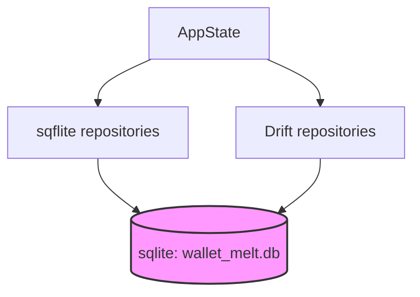

# WalletMelt Repository Orientation Guide

This document provides a comprehensive technical overview and map of the WalletMelt codebase. It outlines the application entrypoint, state management layers, storage paradigms (sqflite and Drift), screen structure, testing hierarchy, and generated-file boundaries.

---

## 1. Top-Level Folder Map

The root directory of WalletMelt contains the standard Flutter folder hierarchy along with database artifacts and tools:

```text
D:\Web Projects\WalletMelt
├── .agents/                   # Official Antigravity workspace-specific configuration folder
│   ├── agents/                # Sub-agent configurations (agent.json)
│   ├── skills/                # Task-specific capabilities (SKILL.md)
│   ├── WALLETMELT_AGENT_ROUTING.md
│   └── WALLETMELT_REPO_ORIENTATION.md
├── .dart_tool/                # Dart tool compilation artifacts (automatically generated)
├── .idea/                     # IDE configuration files
├── android/                   # Android native platform implementation and build configuration
├── build/                     # Compiled assets and build targets
├── docs/                      # Architectural documents, guides, and plans
├── ios/                       # iOS native platform folder
├── lib/                       # Application source code
│   ├── main.dart              # Application entrypoint
│   └── src/                   # Source files structured by layer
│       ├── app/               # Main application widget and router configuration
│       ├── components/        # Reusable UI widgets and custom layout blocks
│       ├── constants/         # App constants (categories, styling assets)
│       ├── data/              # Database layers (schemas, migrations, repositories)
│       ├── hooks/             # Custom flutter_hooks if applicable
│       ├── providers/         # Riverpod provider definitions
│       ├── screens/           # Feature-based view screens (dashboard, history, etc.)
│       ├── services/          # Supporting services (settings, local storage, receipt storage)
│       ├── state/             # Legacy Provider state management (AppState)
│       ├── theme/             # Design system specifications and styling definitions
│       ├── types/             # Immutable domain models and data types
│       └── utils/             # Helper utilities (date formatting, insight calculators)
├── test/                      # Test suite containing unit, widget, and integration tests
├── pubspec.yaml               # Project configuration, dependencies, and assets
└── pubspec.lock               # Exact dependency lockfile
```

---

## 2. App Entrypoint & Routing

### App Entrypoint
* **Location:** [lib/main.dart](file:///D:/Web%20Projects/WalletMelt/lib/main.dart)
* **Responsibilities:** Initializes Flutter bindings (`WidgetsFlutterBinding.ensureInitialized()`) and bootstraps the main widget by calling `runApp(const WalletMeltBootstrap())`.

### Routing & Navigation
* **Location:** [lib/src/app/wallet_melt_app.dart](file:///D:/Web%20Projects/WalletMelt/lib/src/app/wallet_melt_app.dart)
* **Routing Framework:** Uses **GoRouter** (version `^17.3.0`).
* **Route Configuration:**
  - `/onboarding`: Onboarding flow screen.
  - `/`: Dashboard screen (default home path, inside navigation shell).
  - `/history`: Expense history screen (inside navigation shell).
  - `/insights`: Financial analytics insights (inside navigation shell).
  - `/settings`: App settings (inside navigation shell).
  - `/expense/new`: Create expense form.
  - `/expense/:id`: Detailed view of a specific expense.
  - `/expense/:id/edit`: Edit screen for an existing expense.
* **Navigation Shell:** Uses `StatefulShellRoute.indexedStack` with `AppShell` in [lib/src/components/navigation/app_shell.dart](file:///D:/Web%20Projects/WalletMelt/lib/src/components/navigation/app_shell.dart) to preserve navigation state between tabs.
* **Guard Rails:** The router listens to `AppState` updates. If onboarding settings are incomplete (`hasCompletedOnboarding == false`), it dynamically redirects the user to `/onboarding`.

---

## 3. State Management Structure

WalletMelt is currently transitioning its state management approach from a monolithic **Provider/ChangeNotifier** model to a modular **Riverpod** design.

### Provider (ChangeNotifier)
* **Primary Store:** `AppState` in [lib/src/state/app_state.dart](file:///D:/Web%20Projects/WalletMelt/lib/src/state/app_state.dart)
* **Responsibilities:**
  - Central controller of the active user session.
  - Coordinates initialization of legacy repositories and Drift database.
  - Holds active session data: `categories`, `expenses`, `deletedExpenses`, `currentBudgets`, `selectedMonth`.
  - Manages operations for categories (adding), budgets (setting/clearing), and expenses (creating, updating, soft-deleting, restoring, deleting).
  - Manages system settings changes (currency, theme preferences).
  - Listens to/extends changes to child states and calls `notifyListeners()`.
* **Placement:** Initialized via `ChangeNotifierProvider` in `WalletMeltBootstrap` beneath Riverpod's `ProviderScope`.

### Riverpod
* **Scope Placement:** Global `ProviderScope` is declared at the root of `WalletMeltBootstrap`.
* **Provider Locations:** [lib/src/providers/](file:///D:/Web%20Projects/WalletMelt/lib/src/providers)
* **Providers Defined:**
  - `database_providers.dart`: Exposes `sqfliteDatabaseProvider` and `walletMeltDatabaseProvider` (Drift).
  - `repository_providers.dart`: Exposes repository instances (both sqflite-based and Drift-based repositories).
  - `budget_providers.dart`: Riverpod-based budget queries and streams.
  - `category_providers.dart`: Riverpod-based category streams.
  - `settings_providers.dart`: Riverpod-based settings access.
* **Role:** Currently used for database access and repository dependency injection. Over time, features are migrating their runtime reads to Riverpod providers while `AppState` maintains legacy write routing.

---

## 4. Database & Storage Architecture

WalletMelt uses a hybrid storage architecture as it undergoes V2 upgrades. The app uses both **sqflite** (legacy SQLite) and **Drift** (modern Dart-first SQLite wrapper).



### sqflite (Legacy SQLite)
* **Database Instance:** managed by `AppDatabase` in [lib/src/data/db/app_database.dart](file:///D:/Web%20Projects/WalletMelt/lib/src/data/db/app_database.dart).
* **Database File:** `wallet_melt.db` (Version 1).
* **Schema Definition:** Centralized SQL strings in [lib/src/data/schema/database_schema.dart](file:///D:/Web%20Projects/WalletMelt/lib/src/data/schema/database_schema.dart).
* **Repositories:**
  - [lib/src/data/repositories/category_repository.dart](file:///D:/Web%20Projects/WalletMelt/lib/src/data/repositories/category_repository.dart)
  - [lib/src/data/repositories/budget_repository.dart](file:///D:/Web%20Projects/WalletMelt/lib/src/data/repositories/budget_repository.dart)
  - [lib/src/data/repositories/expense_repository.dart](file:///D:/Web%20Projects/WalletMelt/lib/src/data/repositories/expense_repository.dart)

### Drift (SQLite Web/Desktop/Mobile wrapper)
* **Database Class:** `WalletMeltDatabase` in [lib/src/data/local/wallet_melt_database.dart](file:///D:/Web%20Projects/WalletMelt/lib/src/data/local/wallet_melt_database.dart) (Version 2).
* **Generated code:** `wallet_melt_database.g.dart` (generated by `build_runner`).
* **Additive V2 Schema:** Table schemas are written using Drift DSL (e.g., `Categories`, `Expenses`, `GroceryItems`, `CategoryBudgets`, `Units`, `Stores`, `Items`, `ItemAliases`, `ExpenseItems`, `Receipts`, `MigrationAudit`).
* **Repositories:**
  - [lib/src/data/repositories/drift/drift_category_repository.dart](file:///D:/Web%20Projects/WalletMelt/lib/src/data/repositories/drift/drift_category_repository.dart)
  - [lib/src/data/repositories/drift/drift_budget_repository.dart](file:///D:/Web%20Projects/WalletMelt/lib/src/data/repositories/drift/drift_budget_repository.dart)
  - [lib/src/data/repositories/drift/drift_expense_repository.dart](file:///D:/Web%20Projects/WalletMelt/lib/src/data/repositories/drift/drift_expense_repository.dart)
  - [lib/src/data/repositories/drift/drift_item_repository.dart](file:///D:/Web%20Projects/WalletMelt/lib/src/data/repositories/drift/drift_item_repository.dart)
  - [lib/src/data/repositories/drift/drift_receipt_repository.dart](file:///D:/Web%20Projects/WalletMelt/lib/src/data/repositories/drift/drift_receipt_repository.dart)
  - [lib/src/data/repositories/drift/drift_store_repository.dart](file:///D:/Web%20Projects/WalletMelt/lib/src/data/repositories/drift/drift_store_repository.dart)

### Dual-Database Runtime Strategy
* **Read-Fallback Strategy:** `AppState` tries to load category lists and monthly budgets from the Drift repositories. If a Drift read fails, it catches the exception and falls back to the proven sqflite repositories.
* **Migration Mechanism:** Drift includes automatic V1-to-V2 database migration logic. When opening the database, it creates a database backup file (`wallet_melt.pre_v2_*.db`), upgrades the database schema, seeds default units/categories, and validates row counts and totals before completing the audit log.

---

## 5. Domain Models (Immutable Types)

* **Location:** [lib/src/types/](file:///D:/Web%20Projects/WalletMelt/lib/src/types)
* **Structure:**
  - [category.dart](file:///D:/Web%20Projects/WalletMelt/lib/src/types/category.dart): Model representing expense categories (color, icon, ID, name, default status).
  - [expense.dart](file:///D:/Web%20Projects/WalletMelt/lib/src/types/expense.dart): Model representing a transaction/expense (ID, title, amount, currency, categoryId, dates, recurrence frequency).
  - [grocery_item.dart](file:///D:/Web%20Projects/WalletMelt/lib/src/types/grocery_item.dart): Represents items associated with grocery/bill itemization.
  - [budget.dart](file:///D:/Web%20Projects/WalletMelt/lib/src/types/budget.dart): Monthly budget configuration per category.
  - [settings.dart](file:///D:/Web%20Projects/WalletMelt/lib/src/types/settings.dart): User preferences model (theme, onboarding completion, default currency).

---

## 6. Screens & Presentation Structure

Screens are isolated feature folders located in [lib/src/screens/](file:///D:/Web%20Projects/WalletMelt/lib/src/screens):

1. **Dashboard (`/`)**:
   - Summary cards, current budgets, quick insights, and a list of recent expenses.
2. **History (`/history`)**:
   - Filterable expense timelines and detailed lists. Contains `expense_detail_screen.dart` to view and edit details.
3. **Insights (`/insights`)**:
   - Expense categorization charts, trend graphs, monthly budgets, and spending comparisons.
4. **Settings (`/settings`)**:
   - Options to configure currency, system themes, reset app database, or perform backups.
5. **Onboarding (`/onboarding`)**:
   - Initial currency setup and intro sliders.
6. **Add Expense (`/expense/new`, `/expense/:id/edit`)**:
   - Forms to input amount, category, title, notes, vendor details, upload/take photos of receipts, and itemize groceries.

---

## 7. Theme & Design System

* **Location:** [lib/src/theme/wallet_melt_theme.dart](file:///D:/Web%20Projects/WalletMelt/lib/src/theme/wallet_melt_theme.dart)
* **Design Philosophy:** Uses a modern premium card-based layout. Supports dynamic Dark and Light Material 3 theme configurations.

---

## 8. Test Suite Structure

Located in the [test/](file:///D:/Web%20Projects/WalletMelt/test) directory:

```text
test/
├── drift_migration_test.dart            # Verifies V1 -> V2 schema upgrades, fallback safety, and rollbacks
├── expense_validation_test.dart        # Unit tests verifying formatting and validations of expense values
├── insights_test.dart                  # Validates deterministic calculations (sums, trends, averages)
├── riverpod_foundation_test.dart       # Tests Riverpod providers, database overrides, and mock injectors
├── widget_test.dart                    # Quick smoke tests for UI widgets
├── providers/                          # Tests covering Riverpod provider states
│   ├── budget_providers_test.dart
│   └── category_providers_test.dart
└── repositories/                       # Database repository layer test suites
    ├── drift_budget_repository_test.dart
    ├── drift_category_repository_test.dart
    ├── drift_expense_repository_test.dart
    └── drift_item_store_receipt_repository_test.dart
```

---

## 9. Build, Runtime, & Generated-File Boundaries

* **Dart SDK Environment:** `>=3.3.0 <4.0.0`
* **Dependency Managers:** managed inside [pubspec.yaml](file:///D:/Web%20Projects/WalletMelt/pubspec.yaml).
* **Generated Code Files:**
  - Database layout: [lib/src/data/local/wallet_melt_database.g.dart](file:///D:/Web%20Projects/WalletMelt/lib/src/data/local/wallet_melt_database.g.dart)
  - Generated files are regenerated using:
    ```powershell
    dart run build_runner build --delete-conflicting-outputs
    ```
  - **CRITICAL:** Do NOT modify `wallet_melt_database.g.dart` by hand. Always update the table schemas in `wallet_melt_database.dart` and run build_runner.
