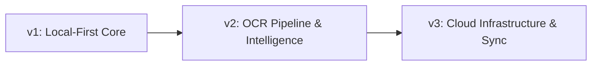

# WalletMelt

**Know where your money went.**

WalletMelt is an open-source, local-first household expense tracker designed for people who reach the end of the month and wonder where their money went. It tracks rent, utilities, groceries, maintenance, custom categories, budgets, and local receipt/bill images without mandatory logins or intrusive third-party tracking.

📖 **Read the Full Case Study & Deep Dive:** [shkmuneeb.dev/projects/walletmelt](https://shkmuneeb.dev/projects/walletmelt)

---

## 🌟 Highlights

- **Open Source & Privacy-First**: 100% offline-capable by default with zero tracking and full data ownership.
- **Robust Storage**: Drift-first local persistence layer with legacy SQLite fallback and ACID transactional safety.
- **Smart Itemization**: Detailed grocery breakdown, custom categories, budget tracking, and soft-delete recycle bin.
- **Liquid-Glass Design**: Warm, accessible Material 3 interface with dark/light theme switching and responsive charts (`fl_chart`).
- **Comprehensive Backups**: Local backup ZIP packaging, JSON metadata schema, and CSV exports.

## 🛠️ Tech Stack

- **Framework**: Flutter 3.44.2 + Dart 3.12.2
- **Navigation**: `go_router` 17.3.0
- **State Management**: `provider` 6.1.5+1 (UI source of truth) + `riverpod` (dependency injection & repo layer)
- **Local Database**: `drift` (type-safe SQLite persistence) + `sqflite` (legacy fallback layer)
- **File & Media Storage**: `path_provider` 2.1.5, `image_picker` 1.2.2, `flutter_image_compress` 2.4.0
- **Visuals & Charts**: `fl_chart` 1.2.0, Material 3 liquid-glass theme system
- **Utilities**: `intl` 0.20.2, `shared_preferences` 2.5.5

## 🚀 Getting Started

### Prerequisites

Ensure you have the Flutter SDK installed (3.44+ recommended).

### Setup

```bash
flutter pub get
flutter create . --platforms android,ios --project-name wallet_melt --org app.walletmelt
flutter pub get
```

> **Note**: `flutter create .` generates the native Android/iOS runner files while preserving existing source code, tests, and documentation.

### Run

**Android:**
```bash
flutter run -d android
```

**iOS:**
```bash
flutter run -d ios
```

### Testing & Verification

```bash
flutter analyze
flutter test
flutter build apk --release
```

## 📂 Project Structure

```text
lib/
  main.dart
  src/
    app/          # Application shell and routing (go_router)
    components/   # Reusable UI components & liquid-glass cards
    constants/    # Design tokens, styling constants, theme palettes
    data/         # Drift tables, DAOs, repositories, sqflite fallback
    providers/    # Riverpod DI & database provider layer
    screens/      # Screen views (Dashboard, Add Expense, History, Insights, Settings)
    services/     # Receipt storage, image compression, settings, export/backup
    state/        # Screen-facing state management (AppState)
    theme/        # Theme definitions & color schemes
    types/        # Domain entities and models
    utils/        # Date, currency, and calculation helpers
docs/             # Architectural specs, case study notes, migration status, and v3 roadmap
test/             # Unit and widget test suite
```

## 🗺️ Product Roadmap

WalletMelt is evolving from a local-first mobile tracker into a comprehensive, multi-platform financial management platform.



### ✅ Version 1 — Local-First Core (Current)
- [x] Local-first offline expense and budget tracking
- [x] Drift-first transactional storage engine with sqflite safety fallback
- [x] Local receipt image capture, compression, and isolated storage
- [x] Grocery line-item breakdown and itemized categorization
- [x] Soft-delete lifecycle with recycle bin restoration
- [x] Spending insights, budget progress gauges, and trend charts
- [x] Full JSON backup archive & CSV export capabilities

### 🔍 Version 2 — OCR Pipeline & Receipt Intelligence
- [ ] **Automated Receipt Parsing**: Multi-engine OCR pipeline (Google Cloud Document AI Expense Parser & on-device fallback)
- [ ] **Entity Extraction**: Automatic detection of merchant/vendor, transaction date, line items, taxes, tips, and totals
- [ ] **Confidence-Scored Review**: UI review workflow highlighting extracted fields with visual confidence thresholds
- [ ] **Background Processing**: Asynchronous worker queue for receipt compression, thumbnail generation, and OCR dispatch
- [ ] **Smart Matching**: Auto-associating scanned physical receipts with pending or existing bank/cash transactions

### ☁️ Version 3 — Cloud Infrastructure & Platform Transformation
- [ ] **Backend Architecture**: NestJS modular monolith with PostgreSQL 16, PgBouncer, and Redis (BullMQ queue workers)
- [ ] **Cloud Sync Engine**: Resilient offline-first push/pull delta sync with WebSocket real-time change signals
- [ ] **Deterministic Conflict Resolution**: Last-Write-Wins (LWW) with user-choice resolution modals for critical budget shifts
- [ ] **Cloud Receipt Storage**: Cloudflare R2 object storage with signed URL uploads and CDN caching
- [ ] **Next.js 15 Web Platform**: Desktop-optimized web dashboard with TanStack Table virtual scrolling and CSV import/export
- [ ] **Household Collaboration**: Shared household workspaces, multi-user permissions (Owner/Admin/Member), and split expenses
- [ ] **Rule-Based Financial Intelligence**: Anomaly detection, recurring expense identification, and predictive budget alerts
- [ ] **Cross-Platform Notifications**: Firebase Cloud Messaging (FCM) & APNs for budget limits and bill reminders
- [ ] **Subscription & Billing**: Multi-tier monetization (Free, Plus, Family, Pro) integrated with Paddle

For detailed architecture diagrams and implementation specifications, refer to [`docs/WALLETMELT_V3_ROADMAP.md`](docs/WALLETMELT_V3_ROADMAP.md).

## 📄 Case Study

For a comprehensive deep dive into the UX decisions, architectural evolution from sqflite to Drift, state management strategy, and future scaling plans, read the full case study:
🔗 **[shkmuneeb.dev/projects/walletmelt](https://shkmuneeb.dev/projects/walletmelt)**

## 🤝 Contributing

Contributions are welcome! Please feel free to open issues or submit pull requests to help improve WalletMelt.

## 📜 License

This project is licensed under the [MIT License](LICENSE).
