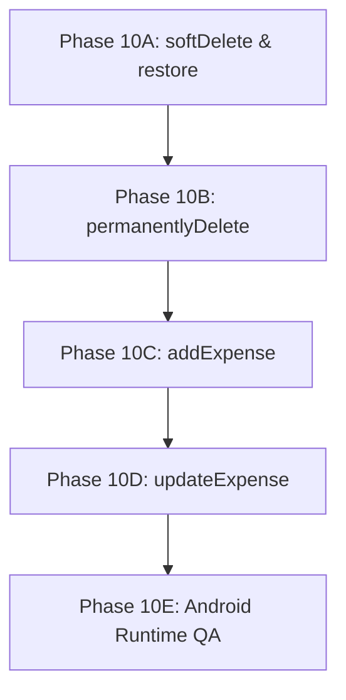

# WalletMelt V2 Phase 9B: Expense Write Migration Plan

This document outlines the detailed, implementation-ready plan for migrating all expense write operations in `AppState` to the new Drift-first architecture with sqflite fallback execution. 

---

## 1. Current Write Architecture

In `AppState` (`lib/src/state/app_state.dart`), all expense write operations currently bypass the Drift layer and directly execute on the legacy sqflite `ExpenseRepository`:

```dart
// lib/src/state/app_state.dart

Future<Expense> addExpense(ExpenseDraft draft) async {
  final expense = await _expenseRepository.create(draft);
  await refresh();
  return expense;
}

Future<void> updateExpense(Expense expense, {List<GroceryItemDraft>? groceryItems}) async {
  await _expenseRepository.update(expense, groceryItems: groceryItems);
  await refresh();
}

Future<void> softDeleteExpense(String id) async {
  await _expenseRepository.softDelete(id);
  await refresh();
}

Future<void> restoreExpense(String id) async {
  await _expenseRepository.restore(id);
  await refresh();
}

Future<void> permanentlyDeleteExpense(String id) async {
  final expense = await _getExpenseById(id, includeDeleted: true);
  await _expenseRepository.permanentlyDelete(id);
  final receipt = expense?.receiptImageUri;
  if (receipt != null) {
    await receiptStorage.delete(receipt);
  }
  await refresh();
}
```

### Key Behaviors & Details:
- **Refreshes After Writes:** Every write method immediately awaits `refresh()`, which re-fetches active/deleted lists from the database, updating both `AppState.expenses` and `AppState.deletedExpenses` to trigger UI updates.
- **Grocery Itemizations:** The sqflite implementation replaces grocery items within a single database transaction, clearing existing ones and inserting the new list.
- **Receipts:** The sqflite repository saves the file URI directly on the `expenses` row under the `receiptImageUri` field.
- **Deletes:**
  - **Soft Delete:** Sets `deletedAt` and `updatedAt` to the current ISO8601 timestamp.
  - **Restore:** Resets `deletedAt` to `null` and updates `updatedAt`.
  - **Permanent Delete:** Removes the expense row from the database and uses the `ReceiptStorageService` (`receiptStorage.delete(uri)`) to remove the actual file from the local disk.

---

## 2. Drift Repository Capability Matrix

The following table summarizes the comparison between the legacy `sqflite` repository and the V2 `DriftExpenseRepository`:

| Write Operation | sqflite repository behavior | Drift repository behavior | Parity Status | Gaps/Risks | Tests Available |
| :--- | :--- | :--- | :--- | :--- | :--- |
| **create** | Creates `Expense` row and replaces items in `grocery_items` table transactionally. | Creates `Expense` row. Populates both legacy `grocery_items` and V2 `expense_items` & `items` tables. Stores receipt in `receipts` table. All run inside a database transaction. | **Full Parity** | Must ensure generated UUID format remains consistent. | `test/repositories/drift_expense_repository_test.dart` |
| **update** | Updates `expenses` table and replaces items in `grocery_items` table transactionally. | Updates `expenses` table. Replaces items in both `grocery_items` and `expense_items`. Replaces or deletes receipt row. All run inside a database transaction. | **Full Parity** | Updates `updatedAt` to the current timestamp; must align formatting. | `test/repositories/drift_expense_repository_test.dart` |
| **softDelete** | Updates `expenses.deletedAt` to current timestamp. | Updates `expenses.deletedAt` in database. | **Full Parity** | None. | `test/repositories/drift_expense_repository_test.dart` |
| **restore** | Sets `expenses.deletedAt` to `null`. | Sets `expenses.deletedAt` to `null`. | **Full Parity** | None. | `test/repositories/drift_expense_repository_test.dart` |
| **permanentlyDelete** | Deletes `expenses` row directly. | Deletes `expenses` row (triggers cascading deletes on dependent tables). | **Full Parity** | None. Cascade delete handles dependent rows automatically. | `test/repositories/drift_expense_repository_test.dart` |
| **groceryItemsForExpense** | Selects items from `grocery_items` table. | Selects items from `grocery_items` table. | **Full Parity** | None. | `test/repositories/drift_expense_repository_test.dart` |
| **getById(includeDeleted)** | Queries single row filter by `deletedAt`. | Queries single row filter by `deletedAt`. | **Full Parity** | None. | `test/repositories/drift_expense_repository_test.dart` |
| **listActive** | Queries rows where `deletedAt IS NULL`. | Queries rows where `deletedAt IS NULL`. | **Full Parity** | None. | `test/repositories/drift_expense_repository_test.dart` |
| **listDeleted** | Queries rows where `deletedAt IS NOT NULL`. | Queries rows where `deletedAt IS NOT NULL`. | **Full Parity** | None. | `test/repositories/drift_expense_repository_test.dart` |

---

## 3. Data Integrity Risks

1. **Duplicate IDs:** If a fallback occurs (e.g. Drift write fails and we fall back to sqflite), we must ensure that the same entity ID (generated via `Uuid().v4()`) is used for the sqflite write.
2. **Partial Write Failure:** Creating or updating an expense involves writing to multiple tables (e.g., `expenses`, `grocery_items`, `expense_items`, and `receipts`). If Drift fails halfway through, we must guarantee that no partial data remains in the Drift database.
   * *Mitigation:* Drift's transactional block (`_db.transaction(() async { ... })`) naturally rolls back all modifications if any query throws.
3. **Receipt Storage Desync:** During `permanentlyDeleteExpense`, if the database row deletion succeeds but the local file deletion fails, orphaned files will leak storage.
   * *Mitigation:* Perform file deletion *only* after database deletion succeeds, wrapping the operations in try-catch blocks.
4. **Active/Deleted List Desync:** If a write is applied only to Drift and fails to propagate (or vice-versa), `listActive` and `listDeleted` could return mismatching data if the database state is inconsistent.
   * *Mitigation:* Always enforce dual-write fallback patterns or clear, single-point-of-truth semantics.

---

## 4. Migration Strategy Options

### Option A: Drift-First writes with sqflite fallback
- **Description:** Try to write via `DriftExpenseRepository`. If it succeeds, return. If it fails or throws, catch the exception and execute the write on `sqflite`'s repository.
- **Pros:** Preserves full fallback capability, keeping the app functional even during local database locking or corruption.
- **Cons:** Dual maintenance of fallback handlers for write paths.
- **Risk Level:** Low.
- **Test Burden:** Moderate (requires mock tests that intentionally throw Drift errors to verify fallback).
- **Recommendation:** **RECOMMENDED**. Consistent with read fallbacks.

### Option B: sqflite writes remain, Drift only mirrors
- **Description:** Writes always run on sqflite. Drift database receives mirrored records asynchronously or in parallel.
- **Pros:** Minimal change to proven sqflite write paths.
- **Cons:** High risk of drift/desync between databases. Delayed consistency.
- **Risk Level:** High.
- **Test Burden:** High.
- **Recommendation:** **NOT RECOMMENDED**.

### Option C: One write method at a time (Starting with Deletes)
- **Description:** Migrate `softDelete` and `restore` first (low complexity), verify them fully in production, then migrate `permanentlyDelete`, and finally migrate `addExpense`/`updateExpense` (high complexity, itemization/receipt side effects).
- **Pros:** Extremely safe, incremental validation.
- **Cons:** Extends the migration duration over multiple phases.
- **Risk Level:** Very Low.
- **Test Burden:** Controlled.
- **Recommendation:** **RECOMMENDED**. This is the safest transition model.

---

## 5. Recommended Phase Breakdown

To align with safety constraints, we divide the write migration into 4 clean, test-driven phases:



### Phase 10A: softDelete & restore
- **Scope:** Migrate `softDeleteExpense` and `restoreExpense` behind `AppState`.
- **Logic:** Try `DriftExpenseRepository.softDelete` / `.restore`. If it throws, fallback to sqflite.

### Phase 10B: permanentlyDelete
- **Scope:** Migrate `permanentlyDeleteExpense` behind `AppState`.
- **Logic:** Fetch expense, try `DriftExpenseRepository.permanentlyDelete(id)` (relies on Drift cascade delete for receipts/grocery items), fallback to sqflite on error, and finally delete the local receipt file.

### Phase 10C: addExpense
- **Scope:** Migrate `addExpense(ExpenseDraft draft)` behind `AppState`.
- **Logic:** Try `DriftExpenseRepository.create(draft)`. Fallback to sqflite on error.

### Phase 10D: updateExpense
- **Scope:** Migrate `updateExpense(Expense expense, ...)` behind `AppState`.
- **Logic:** Try `DriftExpenseRepository.update(expense)`. Fallback to sqflite on error.

### Phase 10E: Android Runtime QA
- **Scope:** Full persistence and manual smoke testing of write operations on `Test_API_36` / `emulator-5554`.

---

## 6. Required Tests Before Each Write Migration

Each phase must be accompanied by focused tests in `test/app_state_test.dart` using local fakes:

### For Phase 10A:
- **softDelete uses Drift first:** Verify that `driftExpenseRepo.softDelete` is invoked and local list updates.
- **softDelete fallback to sqflite:** Verify that if `driftExpenseRepo.softDelete` throws, `expenseRepo.softDelete` is invoked instead.
- **restore uses Drift first:** Verify that `driftExpenseRepo.restore` is invoked.
- **restore fallback to sqflite:** Verify that if `driftExpenseRepo.restore` throws, `expenseRepo.restore` is invoked.

### For Phase 10B:
- **permanentlyDelete uses Drift first:** Verify `driftExpenseRepo.permanentlyDelete` is invoked.
- **permanentlyDelete deletes receipt file:** Verify `receiptStorage.delete` is called on the file path.
- **permanentlyDelete fallback to sqflite:** Verify that if Drift throws, sqflite performs the deletion and file cleanup completes successfully.

### For Phase 10C:
- **addExpense writes atomically:** Verify that both expense metadata and grocery items are written.
- **addExpense fallback works:** Verify that if Drift throws, sqflite adds the expense successfully.

### For Phase 10D:
- **updateExpense writes updates:** Verify edits propagate to active lists.
- **updateExpense fallback works:** Verify sqflite updates on Drift failure.

---

## 7. Runtime QA Checklist for Expense Writes

After completing write migrations, execute the following manual tests on emulator `Test_API_36` (`emulator-5554`):

1. [ ] **Launch App:** Boot and verify dashboard loads without error.
2. [ ] **Add Simple Expense:** Create an expense with a custom title and amount. Verify it renders in the list and updates the monthly summary.
3. [ ] **Add Grocery Expense:** Create an expense under the `grocery` category and add 3 grocery items. Verify items list under the expense details.
4. [ ] **Soft Delete Expense:** Navigate to an expense, click "Move to recycle bin". Verify it disappears from active history.
5. [ ] **Recycle Bin View:** Click the Recycle Bin icon in History. Verify the soft-deleted expense is listed.
6. [ ] **Restore Expense:** Click "Restore" on the deleted expense. Verify it returns to the active history list.
7. [ ] **Permanent Delete:** Navigate to the recycle bin, click "Delete forever" on the expense. Verify it is permanently removed.
8. [ ] **Verify Persistence:** Add an expense, restart the application, and verify it still exists in the list.

---

## 8. Guardrails

- **No Direct Riverpod Write UI Changes:** Do not refactor screens to use Riverpod state writers. Keep `AppState` (Provider) as the primary screen-facing layer.
- **No Schema Modifications:** Do not edit Drift table structures during these write migrations.
- **Always Verify Failures:** Fallback catch blocks must catch **all** exceptions (`catch (_)`) to prevent unhandled database errors from reaching the user.
- **Atomic Itemizations:** Grocery/expense item updates must always execute in transaction blocks.

---

## 9. Final Recommendation

The next safest step is to execute:
**"Phase 10A — Migrate softDelete/restore expense writes behind AppState, Drift-first with sqflite fallback"**

This isolates the first write migration to the simplest operations (`softDelete` and `restore`), minimizing the risk of side effects on complex structures (like grocery items and receipt image files).
